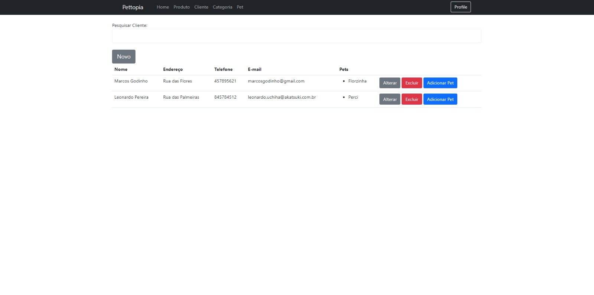

# PetTopia

O projeto foi elaborado como parte da disciplina de Fábrica de Software do curso de Engenharia de Software na UNIVILLE. Trata-se de um sistema de pet shop que possibilita ao administrador cadastrar produtos, incluindo descrições e fotos, criar usuários e estabelecer categorias para os produtos. Além disso, permite que um usuário comum navegue pelos produtos cadastrados no sistema.

## Autores
- [@leonardozw](https://github.com/leonardozw)
- [@EduardoRei](https://github.com/EduardoRei)
- [@MarcosGodinho](https://github.com/MarcosGodinho)

## Stack utilizada

**Front-end:** Thymeleaf, BootStrap

**Back-end:** Java, SpringBoot

**Banco de Dados:** H2 

## Telas de funcionamento
**Login com Azure**

**Principais Telas do Admin**

**Tela principal do Usuario**

